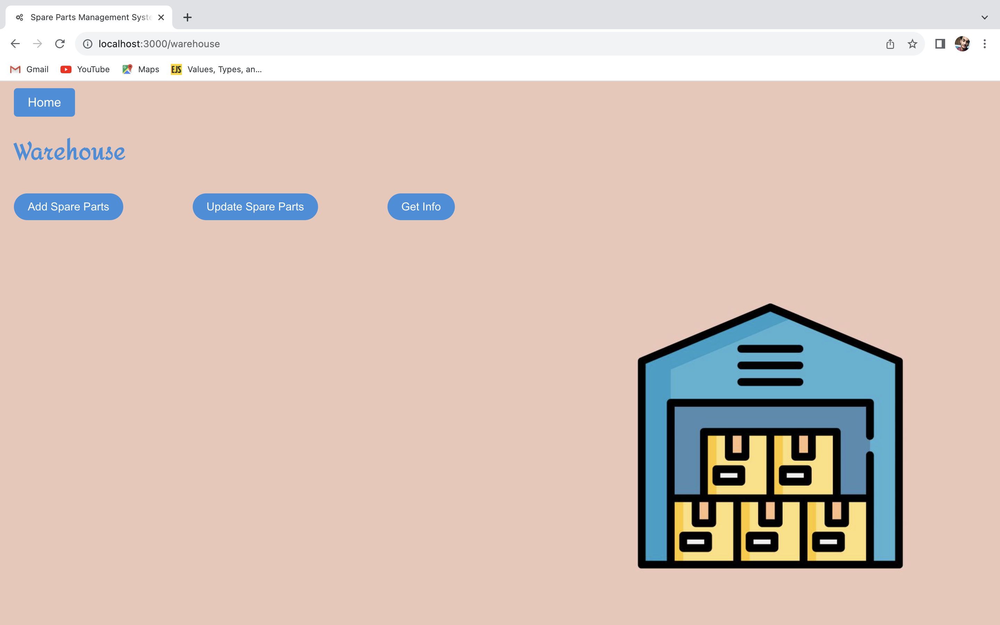
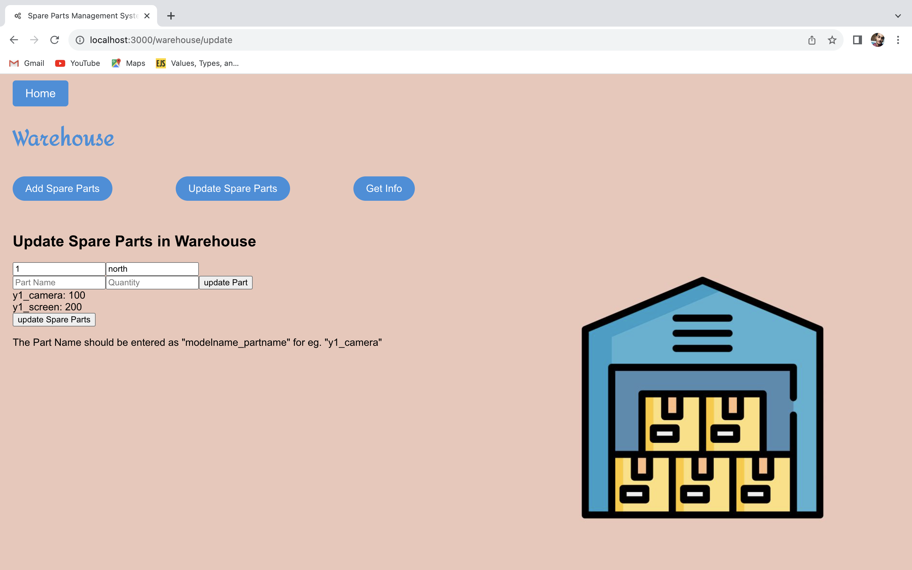
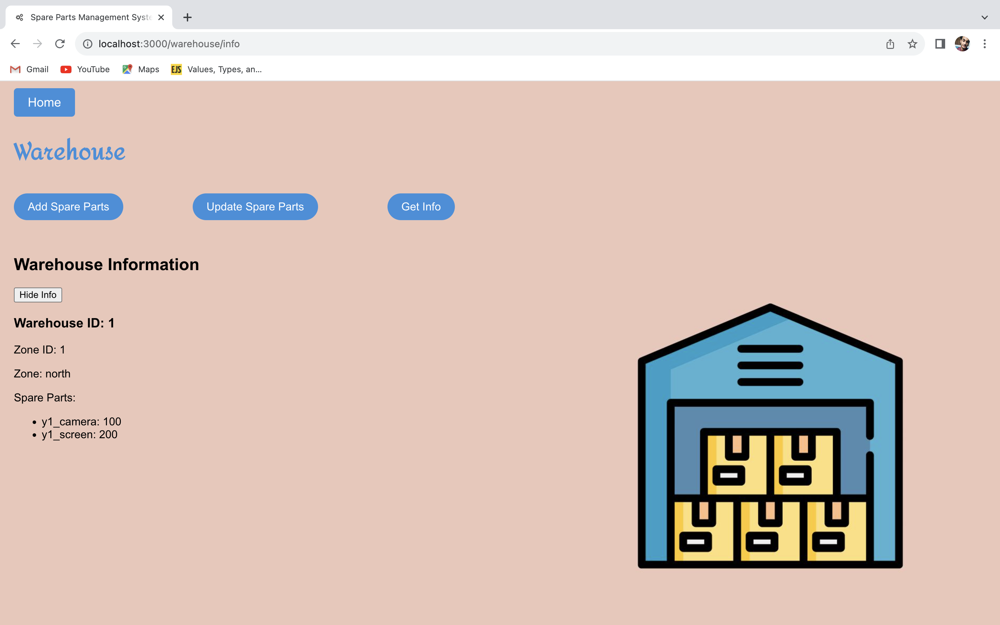

# Spare Parts Management System

The Spare Parts Management System is a comprehensive application designed to manage spare parts effectively. This README provides an overview of the project's flow and explains the functionality of each component.

## Project Flow

### Components

The project consists of the following major components:

1. **Warehouse Management:**

   
   
   - **Add Spare Parts:** Allows users to add new spare parts to the warehouse inventory.
     
     
     
   - **Update Spare Parts:** Provides the ability to update existing spare parts in the warehouse.
     
     
      
   - **Get Information:** Enables users to retrieve information about spare parts stored in the warehouse.

     

1. **Service Center Management:**
   - **Add Spare Parts:** Allows service center staff to add spare parts to the service center inventory.
   - **Update Spare Parts:** Provides the ability to update existing spare parts in the service center inventory.
   - **Get Information:** Enables service center staff to retrieve information about spare parts stored in the service center.

2. **Consumer:**
   - **Order Spare Parts:** Consumers can place orders for spare parts by specifying the Service Center ID and Zone ID. The service center fulfills these orders.
   
3. **Planning Team:**
   - **Request Spare Parts:** Service centers can request spare parts from the warehouse by providing their own ID and the warehouse ID. The warehouse fulfills these requests.

### Zones

There are four zones in the system:
- north (Zone ID: 1)
- south (Zone ID: 2)
- east  (Zone ID: 3)
- west  (Zone ID: 4)

### Service Center

The service center id should be unique for every service center and multiple service centers can belong to single zone.

### Naming Convention

The naming convention for spare parts is as follows: "modelname_partname." For example, a spare part for model y1 named "camera" should be named "y1_camera."

Use the same names that are provided as entries for subsequent references.

This naming convention helps maintain a consistent and organized inventory of spare parts.

Feel free to explore each component's functionality to effectively manage spare parts in the system.
